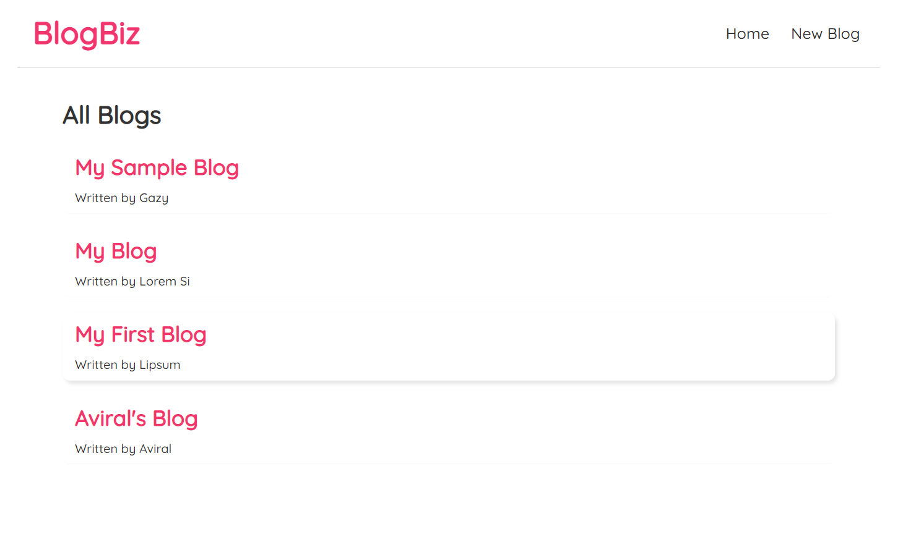
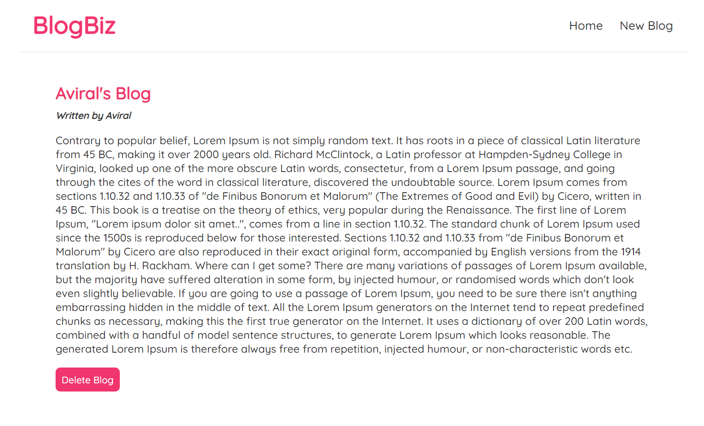

# 📃 BlogBiz
BlogBiz is a web application that allows users to browse, add, and remove blogs.

## 👨‍💻 Tech Stack
* [ReactJS](https://reactjs.org/)
* [CSS](https://www.w3.org/Style/CSS/Overview.en.html)

## 👀 Preview




## 💻 Local Setup and Installation
* Clone the repo and install dependencies
```
$npm install
```
